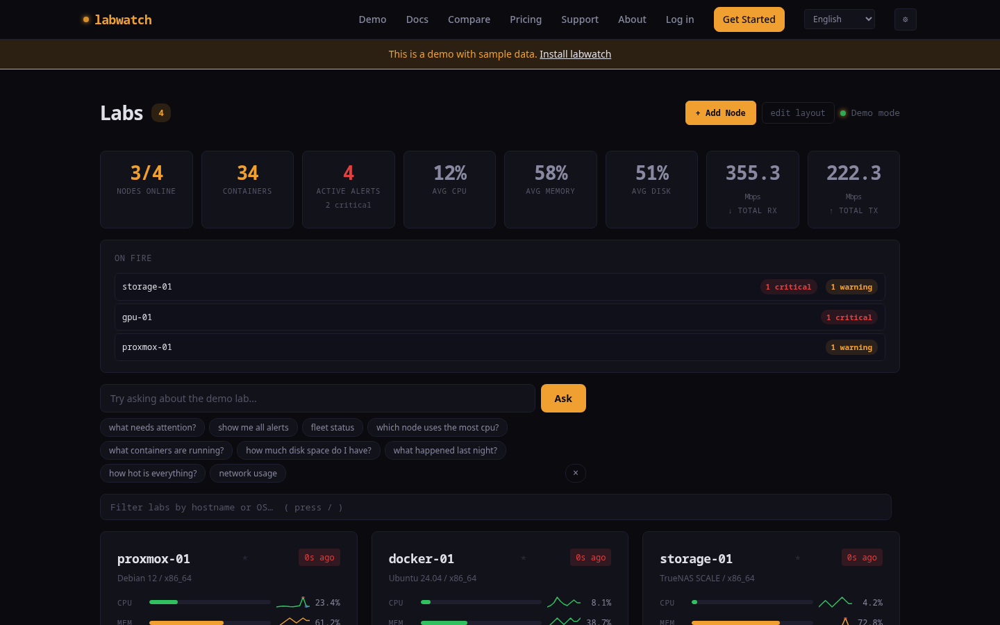
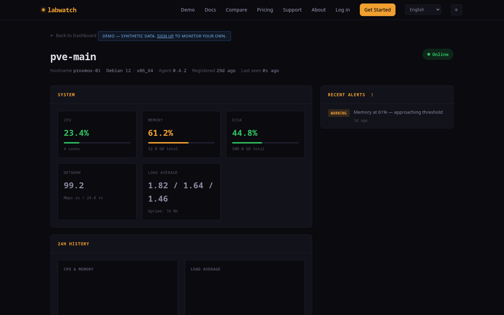

# labwatch

[](LICENSE)
[](agent/LICENSE)

Know what's happening across every node in your homelab — without Grafana, without Prometheus, without YAML hell. A single Go binary per node, a single Docker container for the server, and a dashboard that speaks English.

**[Live demo](https://labwatch.dev/demo)** | **[Docs](https://labwatch.dev/docs)**




## What it does

labwatch collects system metrics, Docker container status, service health, GPU stats, S.M.A.R.T. disk data, ZFS pool health, and centralized logs from every node in your homelab. It stores everything in SQLite, runs rule-based analysis, and generates plain-English intelligence digests about your infrastructure.

**Features:**
- **System metrics** — CPU, memory, disk, load average, network, uptime with inline sparklines
- **Docker monitoring** — container health, restart loops, resource usage
- **Service checks** — monitor HTTP and TCP endpoints via config
- **GPU monitoring** — NVIDIA GPU stats via nvidia-smi
- **S.M.A.R.T. monitoring** — disk health, temperature, reallocated sectors, power-on hours
- **ZFS monitoring** — pool health, capacity, fragmentation, scrub status, error counts
- **Centralized logs** — journald + Docker container logs shipped to server, level/source filters, full-text search, tier-based retention
- **Smart alerts** — deduplication, auto-resolution, severity levels (warning/critical)
- **Push notifications** — 8 channels: webhook, ntfy, Telegram, Discord, Slack, Gotify, Pushover, Apprise
- **Intelligence digests** — narrative health reports with grades (A through C)
- **Natural language queries** — ask "Why is my NAS slow?" and get answers from your metrics
- **Dashboard widgets** — uptime timeline, alert feed, per-node sparklines
- **Drag-and-drop layout** — reorder node cards with mouse or touch (long-press on mobile)
- **Demo mode** — try everything without an account at `/demo`
- **Multi-user accounts** — sign up, pin nodes, set custom alert thresholds
- **i18n** — English, German, French, Spanish, Ukrainian
- **Fleet overview** — all nodes at a glance with health indicators

## Quick start

Two commands to go from zero to monitoring:

### 1. Start the server

```bash
git clone https://github.com/labwatch-dev/labwatch.git && cd labwatch
echo "ADMIN_SECRET=$(openssl rand -hex 24)" >> .env
echo "SESSION_SECRET=$(openssl rand -hex 32)" >> .env
docker compose up -d
```

Server is now live at `http://localhost:8097`. Your secrets are saved in `.env`.

> **Note:** The default port binding (`127.0.0.1:8097`) only accepts local connections.
> To accept agents from other machines, change the port in `docker-compose.yml` to `"8097:8097"`
> or put a reverse proxy (Caddy, nginx) in front.

### 2. Install the agent (on each node)

```bash
curl -fsSL http://YOUR_SERVER:8097/install.sh | sudo bash
```

> Prefer to inspect first? [View the install script](agent/install.sh) or download the binary directly from `/download/`.

Register and configure in one command:

```bash
sudo labwatch --register --server http://YOUR_SERVER:8097/api/v1 --secret YOUR_ADMIN_SECRET
```

This auto-writes `/etc/labwatch/config.yaml` with the correct token and lab ID. Then start:

```bash
sudo systemctl enable --now labwatch
```

Docker, GPU, S.M.A.R.T., and ZFS monitoring are enabled by default — the agent gracefully skips any that aren't available. Add custom service checks (HTTP, TCP) in the config file.

### Multi-node rollout

Run the install script + register on each node:

```bash
ssh root@<IP> 'curl -fsSL http://YOUR_SERVER:8097/install.sh | bash && labwatch --register --server http://YOUR_SERVER:8097/api/v1 --secret YOUR_ADMIN_SECRET && systemctl enable --now labwatch'
```

### Server (manual, without Docker)

```bash
cd server
pip install -r requirements.txt
ADMIN_SECRET=your-secret uvicorn app:app --host 0.0.0.0 --port 8097
```

### Build agent from source

```bash
cd agent
go build -o labwatch -ldflags="-s -w" ./cmd/labwatch/
```

## Architecture

```
┌─────────────┐     ┌─────────────┐     ┌─────────────┐
│  labwatch   │────>│   labwatch  │────>│   SQLite    │
│   agent     │     │   server    │     │   + alerts  │
│  (Go, 8MB)  │     │  (FastAPI)  │     │   + digest  │
└─────────────┘     └─────────────┘     └─────────────┘
  on each node        central host        persistent
```

**Agent**: single static Go binary (linux/amd64, linux/arm64, linux/armv7). No runtime dependencies. Sends metrics over HTTP every 60 seconds. Docker and GPU monitoring enabled by default. Configured via a simple YAML file at `/etc/labwatch/config.yaml`.

**Server**: Python FastAPI with Jinja2 templates. SQLite in WAL mode. Runs rule-based analysis on every ingest cycle. Serves the dashboard, API, agent binaries, and install script from a single process.

## Dashboard

The dashboard shows your entire fleet at a glance:

- **Fleet summary** — total nodes, online count, active alerts, critical alerts, container count
- **Uptime widget** — 24-hour uptime timeline per node (green = up, red = down, gray = no data)
- **Alert feed widget** — chronological alert history with severity indicators
- **Node cards** — CPU/memory/disk bars with inline SVG sparklines showing 1-hour trends
- **Pin nodes** — star your important nodes to keep them at the top
- **Drag to reorder** — rearrange cards by dragging (touch supported with long-press)
- **Natural language query bar** — type questions directly in the UI

Layout preferences (pins, card order) persist in localStorage — no account needed.

## Demo mode

Visit `/demo` to see the dashboard with synthetic data. All features work: drag nodes around, pin them, ask queries, explore widgets. No account or agents required.

## User accounts

Users can sign up at `/signup` to get their own dashboard:

- Add nodes with a personal agent token
- Pin and reorder nodes
- Set custom alert thresholds per node
- Configure notification preferences
- Separate view from the admin dashboard

## Intelligence digests

labwatch generates narrative health reports:

```
media-server had a quiet last 24 hours. Running well below capacity.
CPU usage averaged just 2% — significant headroom for additional workloads.

Health Grade: A

CPU: 2.35% avg, peaked at 14.21%, currently 1.24%
Memory: 35.9% avg, range 34.75%-37.56%, currently 35.15%
Disk: 65.92% avg, currently 65.92%
Alerts: Clean — zero alerts this period
```

Fleet digest:
```
5 nodes monitored. 4 healthy, 1 fair, 0 need attention.

Node Grades: hypervisor A, docker-host A, media-server A, backup-nas B+, dev-server B-

Concerns:
- backup-nas: Sustained high load (12.4) — I/O pressure
- dev-server: Disk at 82% — approaching threshold
```

## Natural language queries

Ask questions in plain English from the dashboard or via API:

```bash
curl -X POST http://localhost:8097/api/v1/query \
  -H "X-Admin-Secret: your-secret" \
  -H "Content-Type: application/json" \
  -d '{"question": "Why is my NAS slow?"}'
```

| Type | Examples |
|------|----------|
| Fleet overview | "How's my lab?", "Give me a summary" |
| Status check | "Is plex running?", "Status of pve-storage" |
| Diagnostics | "Why is my server slow?", "What's causing high load?" |
| Capacity | "Am I running out of disk space?" |
| ZFS pools | "How are my ZFS pools?", "ZFS pool status" |
| Comparative | "Which server uses the most CPU?" |
| Time range | "What happened last night?", "Any issues in the last 6 hours?" |

No LLM required — the engine uses pattern matching and template responses powered by your own metrics.

## Notifications

Push alerts to external services. Supported channels: **webhook**, **ntfy**, **Discord**, **Slack**, **Telegram**, **Gotify**, **Pushover**, and **Apprise**.

```bash
curl -X POST http://localhost:8097/api/v1/admin/notifications \
  -H "X-Admin-Secret: your-secret" \
  -H "Content-Type: application/json" \
  -d '{"name": "phone", "channel_type": "ntfy", "config": {"server": "https://ntfy.sh", "topic": "my-homelab"}, "min_severity": "critical"}'
```

Notifications fire on **new** alerts only — deduplication prevents spam.

## Prometheus export

labwatch exposes a `/metrics` endpoint in Prometheus exposition format. Point your Prometheus scraper at it and visualize labwatch data in Grafana.

```yaml
# prometheus.yml
scrape_configs:
  - job_name: labwatch
    scrape_interval: 60s
    static_configs:
      - targets: ['your-labwatch-server:8097']
    authorization:
      type: Bearer
      credentials: your-admin-secret
    metrics_path: /api/v1/metrics
    scheme: http
```

Exported metrics: `labwatch_cpu_percent`, `labwatch_memory_percent`, `labwatch_disk_percent`, `labwatch_uptime_seconds`, `labwatch_containers_total`, `labwatch_containers_running`, `labwatch_alerts_active`, `labwatch_node_online`, `labwatch_gpu_utilization_percent`, `labwatch_gpu_temperature_celsius`, `labwatch_smart_healthy`, `labwatch_smart_temperature_celsius`, `labwatch_zfs_pool_used_percent`, `labwatch_zfs_pool_healthy`. All labeled with `lab_id` and `hostname` (GPU, S.M.A.R.T., and ZFS metrics include additional `gpu`, `device`, or `pool` labels).

## Alert rules

| Alert | Severity | Condition | Auto-resolves |
|-------|----------|-----------|---------------|
| cpu_high | warning | CPU > 90% | Yes |
| memory_high | warning | Memory > 85% | Yes |
| memory_critical | critical | Memory > 95% | Yes |
| disk_high | warning | Disk > 80% | Yes |
| disk_critical | critical | Disk > 90% | Yes |
| load_high | warning | Load > 2x CPU count | Yes |
| container_restarts | warning | Restarts > 3 | Yes |
| service_failed | critical | Health check fails | Yes |

All alerts deduplicate automatically. When a condition clears, the alert resolves on the next cycle.

## API

| Endpoint | Method | Auth | Description |
|----------|--------|------|-------------|
| `/` | GET | — | Landing page |
| `/demo` | GET | — | Demo dashboard |
| `/health` | GET | — | Health check |
| `/install.sh` | GET | — | Agent install script |
| `/download/{binary}` | GET | — | Agent binary download |
| `/signup` | GET/POST | — | User registration |
| `/login` | GET/POST | — | User login |
| `/my/dashboard` | GET | User | User's dashboard |
| `/my/lab/{id}` | GET | User | User's node detail |
| `/dashboard` | GET | Admin | Admin fleet dashboard |
| `/dashboard/lab/{id}` | GET | Admin | Admin node detail |
| `/api/v1/register` | POST | Admin | Register agent |
| `/api/v1/ingest` | POST | Bearer | Submit metrics |
| `/api/v1/query` | POST | Admin | Natural language query |
| `/api/v1/widgets/uptime` | GET | Admin | Uptime timeline data |
| `/api/v1/widgets/alerts` | GET | Admin | Alert feed data |
| `/api/v1/widgets/sparkline/{id}/{metric}` | GET | Admin | Sparkline data |
| `/api/v1/admin/digest/{id}` | GET/POST | Admin | Node intelligence digest |
| `/api/v1/admin/digest` | POST | Admin | Fleet digest |
| `/api/v1/admin/notifications` | GET/POST | Admin | Notification channels |
| `/api/v1/metrics` | GET | Admin | Prometheus exposition format |
| `/api/v1/admin/lab/{id}/export` | GET | Admin | Export metrics as JSON |
| `/api/v1/admin/lab/{id}/export.csv` | GET | Admin | Export metrics as CSV |
| `/api/v1/my/lab/{id}/export` | GET | User | Export own metrics as JSON |
| `/api/v1/my/lab/{id}/export.csv` | GET | User | Export own metrics as CSV |
| `/api/v1/my/pin/{id}` | POST/DELETE | User | Pin/unpin nodes |
| `/api/v1/my/thresholds/{id}` | GET/PUT/DELETE | User | Custom alert thresholds |
| `/api/v1/lab/{id}/logs` | POST | Bearer | Submit log entries (agent) |
| `/my/lab/{id}/logs` | GET | User | View node logs with filters |
| `/my/lab/{id}/logs/search` | GET | User | Full-text log search |

**Admin auth**: `X-Admin-Secret` header | **Bearer auth**: `Authorization: Bearer <token>` (from registration) | **User auth**: session cookie

## Tech stack

- **Agent**: Go, statically linked, ~8MB binary
- **Server**: Python 3.10+, FastAPI, SQLite (WAL mode), Jinja2
- **Dashboard**: vanilla HTML/CSS/JS, Chart.js for history charts, inline SVG sparklines
- **Design**: dark theme, amber accent, fully responsive

## Comparison

| Feature | labwatch | Beszel + Dozzle | Prometheus + Grafana | Uptime Kuma | Netdata |
|---------|----------|-----------------|---------------------|-------------|---------|
| Setup time | ~2 min | ~10 min (2 tools) | 30+ min | ~5 min | ~5 min |
| Agent footprint | ~15 MB RSS | ~20 MB + 7 MB | ~40 MB (node_exporter) | N/A (pull) | ~150 MB |
| Query language | Plain English | N/A | PromQL | N/A | N/A |
| Intelligence digests | Yes (auto-graded) | No | No | No | No |
| Docker monitoring | Built-in | Beszel: yes | Separate exporter | No | Plugin |
| GPU monitoring | Built-in (NVIDIA) | Beszel: NVIDIA/AMD/Apple | Separate exporter | No | Plugin |
| S.M.A.R.T. health | Built-in | No | Separate exporter | No | Plugin |
| ZFS pool health | Built-in | Partial | Separate exporter | No | No |
| Centralized logs | Built-in (stored, searchable) | Dozzle: live only (no storage) | Loki/Elasticsearch | No | No |
| Alert deduplication | Built-in | No | Alertmanager needed | Built-in | Built-in |
| Notification channels | 8 | Email/webhook | Via Alertmanager | 90+ | Cloud only |
| Self-contained | Yes (one tool) | No (2 tools) | No (3+ services) | Yes | Partial |
| License | AGPL + MIT | MIT + MIT | Apache-2.0 | MIT | GPL-3.0 |

labwatch is not a Prometheus replacement for production infrastructure. It's built for homelabs where you want monitoring that works in 2 minutes, not 2 hours.

## Roadmap

- [x] Nonce-based CSP (131 inline handlers migrated, nonce-only mode)
- [x] Agent retry with exponential backoff
- [x] CSV/JSON data export
- [x] Schema version tracking for smoother upgrades
- [x] S.M.A.R.T. disk health monitoring
- [x] ZFS pool health monitoring
- [ ] More notification channels
- [x] Centralized log collection (journald + Docker, level filters, full-text search, tier-based retention)
- [ ] Mobile-friendly PWA wrapper

See [open issues](https://github.com/labwatch-dev/labwatch/issues) for feature requests.

## Self-hosting

labwatch is designed to run entirely on your own hardware. No cloud dependencies, no telemetry, no external API calls. Your data stays on your network.

The server runs comfortably on a Raspberry Pi or any small VM. The agent uses ~15 MB RAM per node.

## License

- **Server** (Python/FastAPI): [AGPL-3.0](LICENSE)
- **Agent** (Go binary): [MIT](agent/LICENSE)

The agent is MIT-licensed so you can embed it anywhere without restrictions. The server is AGPL — if you modify and host it, share your changes.
